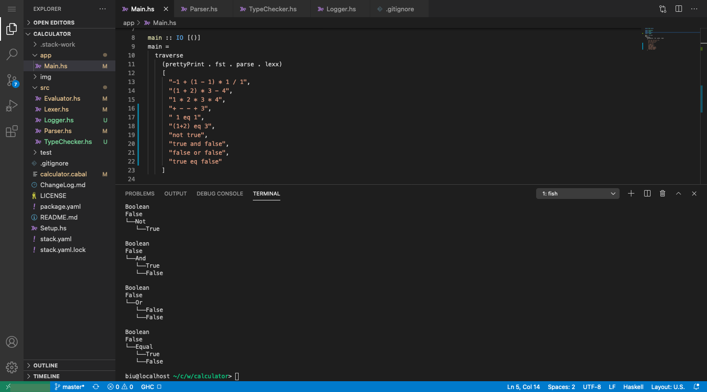

# calculator

an arithmetic calculator written with compiling theory in mind

# reference

> [Exploring Languages with Interpreters and Functional Programming 2018 Version By H. Conrad Cunningham](https://john.cs.olemiss.edu/~hcc/csci450/ELIFP/)
> [Building a Compiler By Immo Landwerth](https://www.youtube.com/playlist?list=PLRAdsfhKI4OWNOSfS7EUu5GRAVmze1t2y)

